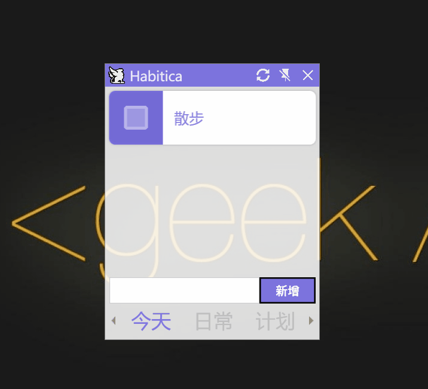
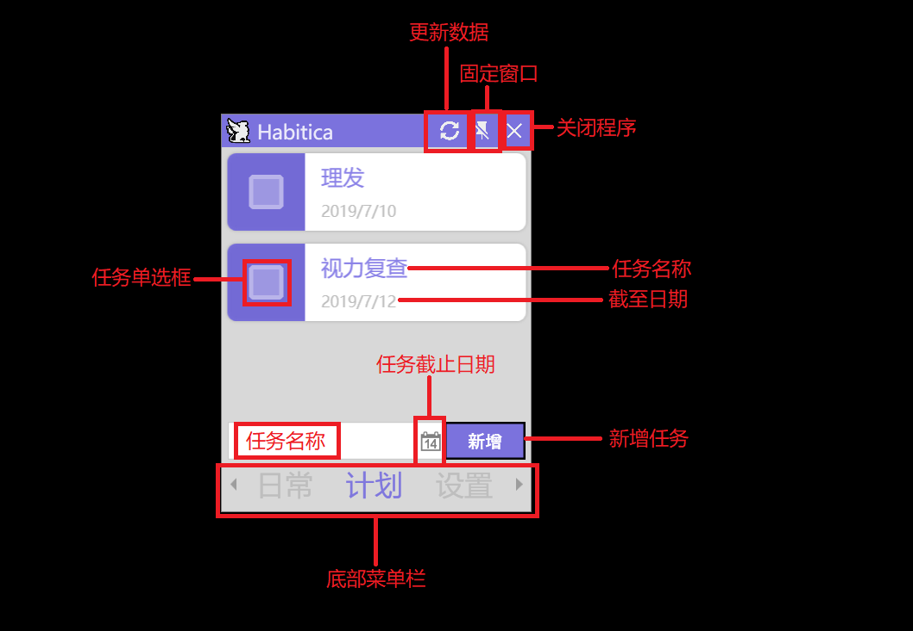

## Habitica Windows

一款基于 WPF 开发并集成 Habitica API 的简易 Todo List

##　预览

## 界面

## 功能

任务列表分为：今天目标、日常目标和计划目标。

今天目标是软件特有的任务分类，就是对应 Habitica 中包含 TodayTarget 标签且截至日期为今天的待办事项；

日常目标即对应 Habitica 的日常；

计划目标对应 Habitica 中其他的待办事项。

## 特色

1. 嵌入桌面，不影响其他软件的显示。

2. 定时从 Habitica 同步数据，每半小时更新一次，亦可手动刷新。

## 如何使用

初始使用默认会跳到设置页面，填写“用户ID”和“API令牌”并保存设置即可。

获取“用户ID”和“API令牌”方法如下：

1. 登录 Habitica 网页版
2. 点击右上角的玩家图标
3. 从弹出的菜单中点击“设定”
4. 点击“API / 应用程序接口”
5. 复制“用户ID”和“API令牌”

##　未实现功能

- [] 自定义透明度
- [] 显示目标清单
- [] 修改目标标题
- [] 本地储存数据
- [] 支持英文

## 下载

[点我下载 :D](https://github.com/zanemmm/Habitica-Windows/releases)

## 为什么选择 WPF 开发

刚开始的时候有打算用 Electron 框架写，毕竟 JavaScript 还算会点而且还能跨平台，但是因为要做嵌入桌面的功能就要调 Win32 的 API，而 Electron 框架调 Win32 API 貌似是天坑，而且 Electron 打包出来的文件巨大，消耗资源也多，所以还是决定用微软自家的技术。然后选择就有三种Winform、WPF、UWP，其中 Winform 太丑，UWP权限管控太严而且只能上架到 Win10 商店，所以就选了 WPF。之前一直没有接触过 C#，但毕竟是玩具项目学习一下乱玩而已，所以这个项目的代码有点惨不忍睹。自用项目，所以没有考虑太多用户体验的问题，以后随着自己的感觉慢慢修正吧，也欢迎 Star、Fork、PR、Issue 等 :D。